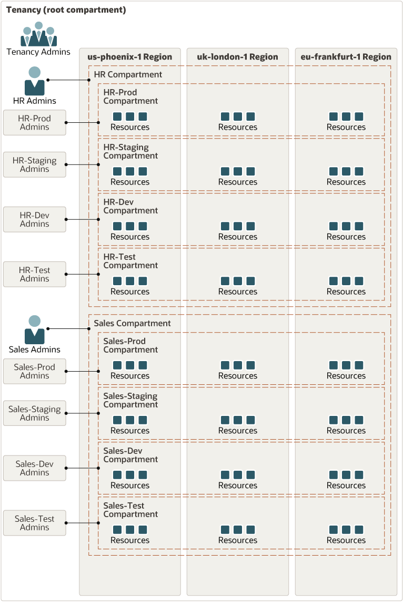

# oci-arch-logging-splunk

This reference architecture shows how to use compartments to design and configure different environments on Oracle Cloud Infrastructure and how to provision resources to support software development and the release life cycle. 

The architecture uses a multi-tier web application as a reference point while allocating resources across different organizations within an enterprise to illustrate the implementation.

## Configuration

### Step 1: Enabling an example service log in OCI Logging

In Step 1, You will create a log group and configure an example using Virtual Cloud Network (VCN) Flow Logs.

Refer the screenshot  and follow the points listed below to complete Step 1.

*   Open the navigation menu on Oracle Cloud Infrastructure (OCI) console. Under Solutions and Platform, go to Logging, and click on Log Groups.

*	Click Create Log Group

    - Choose the `Compartment` where you want to create log group
    - Choose a ```Name``` and ```Description``` that can properly identify your log group

*	Click Create

4.	Next click Logs. The Logs page is displayed.
5.	Click Enable Service Log. The Enable Resource Log panel is displayed.
6.	Under Select Resource, Resource Compartment, choose a compartment you have permission to work in.
7.	Select a service from the Service – For example: Virtual Cloud Network (subnet)
8.	Select a resource:
•	In Resource select a subnet.
9.	Configure the log:
•	In Log Category select a log category to specify the type of log to create. For this example you will select Flow Logs (All records)
•	In Log Name, type a name for the log. For our example we will name it test-flowlog.
10.	Click Enable Log.

### Enabling an example service log in OCI Logging

The OCI Terraform Provider is now available for automatic download through the Terraform Provider Registry. 
For more information on how to get started view the [documentation](https://www.terraform.io/docs/providers/oci/index.html) 
and [setup guide](https://www.terraform.io/docs/providers/oci/guides/version-3-upgrade.html).

* [Documentation](https://www.terraform.io/docs/providers/oci/index.html)
* [OCI forums](https://cloudcustomerconnect.oracle.com/resources/9c8fa8f96f/summary)
* [Github issues](https://github.com/terraform-providers/terraform-provider-oci/issues)
* [Troubleshooting](https://www.terraform.io/docs/providers/oci/guides/guides/troubleshooting.html)

## Prerequisites
First off, you'll need to do some pre-deploy setup.  That's all detailed [here](https://github.com/cloud-partners/oci-prerequisites).

Secondly, create a `terraform.tfvars` file and populate with the following information:

```
# Authentication
tenancy_ocid         = "<tenancy_ocid>"
user_ocid            = "<user_ocid>"
fingerprint          = "<finger_print>"
private_key_path     = "<pem_private_key_path>"

# SSH Keys
ssh_public_key  = "<public_ssh_key_path>"
ssh_private_key  = "<private_ssh_key_path>"

# Region
region = "<oci_region>"

# Compartment
compartment_ocid = "<compartment_ocid>"

````

Deploy:

    terraform init
    terraform plan
    terraform apply

## Destroy the Deployment
When you no longer need the deployment, you can run this command to destroy it:

    terraform destroy

## Compartment Design Architecture


## Reference Archirecture

- [Isolate multi-tier and cross-regional development environments by using compartments](https://docs.oracle.com/en/solutions/ha-web-app/index.html)
