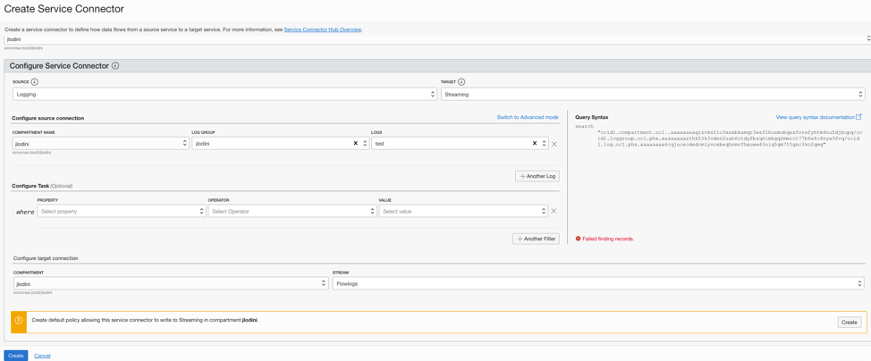
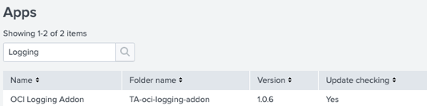
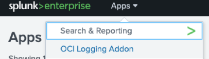
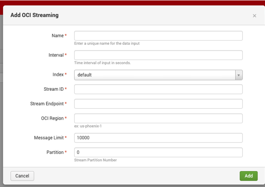
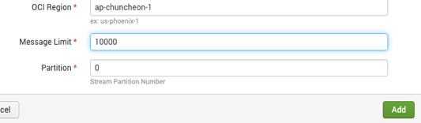

# oci-arch-logging-splunk

A security information and event management (SIEM) system is a critical operations tool to manage the security of your cloud resources. Oracle Cloud Infrastructure includes native threat detection, prevention, and response capabilities, which you can leverage to implement an efficient SIEM system using Splunk.

Splunk Enterprise administrators can use the Logging and Streaming services with the Logging Addon for Splunk, to stream logs from resources in the cloud to an existing or new Splunk environment. Administrators can also integrate with other Splunk plugins and data sources, such as threat intelligence feeds, to augment the generation of alerts based on log data.

## Configuration

### Step 1: Enable an example service log in OCI Logging

In this step, You will create a log group and configure an example log using Virtual Cloud Network (VCN) Flow Logs.

Refer the screenshot and the points listed below to complete Step 1.


*   Open the navigation menu on `Oracle Cloud Infrastructure (OCI)` console. Under `Solutions and Platform`, go to `Logging`, and click on `Log Groups`.

*	Click `Create Log Group`

    - Choose the `Compartment` where you want to create log group
    - Choose a `Name` and `Description` that can properly identify your log group

*	Click `Create`

*   Next click `Logs`. The Logs page is displayed.

*	Click `Enable Service Log`. The Enable Resource Log panel is displayed.

*	Under `Select Resource`, under `Resource Compartment`, choose a compartment you have permission to work in.

*	Select a service from the `Service`. For example: Virtual Cloud Network (subnet)

*	Select a resource:
    - Under `Resource`, select a subnet.

*	Configure the log:

    - In `Log Category` select a log category to specify the type of log to create. For this example, you will select `Flow Logs (All records)`

*	In `Log Name`, type a name for the log. For this example, name it as `test-flowlog`.

*	Click `Enable Log`.

### Step 2: Create a Stream

Refer the screenshot and the points listed below to complete Step 2 to create a stream for log data.


*	Open the `navigation menu`. Under `Analytics`, click `Streaming`.
*	Click `Create Stream`.
*	Next, select `Stream Pool` or `create a new one`.
*	Fill in the Stream Name field with a friendly name for your stream such as `Flowlogs`
*	Provide a Retention time to meet your needs.
*	Provide a Number of Partitions, Total Write Rate, and Total Read Rate based on the amount of data you need to process.


### Step 3: Create a Service Connector in OCI Logging

Refer the screenshot and the points listed below to complete Step 3 to create a Service Connector in OCI Logging.





*	Open the `navigation menu`. Under `Logging`, click `Service Connectors`.
*	Choose the `Compartment` where you want to create the service connector.
*	Click `Create Connector`.
*	On the `Create Service Connector` page, fill in the `settings` as noted below:
    - `Connector Name`: User-friendly name for the new service connector.
    - `Description`: Optional identifier.
    - `Resource Compartment`: The compartment where you want to store the new service connector.
*   Configure Service Connector:
    - `Select Source`: `Logging` 
    - `Select Target`: `Streaming`
*   Under configure source connection:
	- `Compartment`: Select the compartment that contains your log group.
    - `Log Group`: Select the log group created in step 1.
    - `Logs`: Select the log created in step 1.
*   Under configure target connection:
	- `Compartment`: Select the compartment that contains your stream.
    - `Stream`: Select the stream created in step 2.

If you do not have an inclusive IAM policy, you will see the following message:
-   `Create default policy allowing this service connector to write to Streaming in compartment`

To resolve this, click the `Create button` to the right, and it will automatically create a policy for you.

To finish the creation click the `Create button` on the left.

### Step 4: Download and Install the Plugin

`NOTE: Before proceeding with next steps, please open a service request with` [Oracle Support](https://support.oracle.com/portal/) `or ask your account team to reach out to virtual networking product management team to get the downloadable software of the plugin`

Perform the below steps to complete Step 4.

*	Download the plugin provided by Oracle support team.
*	From the Splunk Web home screen, click the `gear icon` next to `Apps`.
*	Click `Install app from file`.
*	Locate the downloaded plugin file and click `Upload`
*	If Splunk prompts you to restart, do so.
*	Verify that the plugin appears in the list of apps and add-ons by clicking Apps -> Manage Apps. You can also find it  on the server at `$SPLUNK_HOME/etc/apps/TA-oci-logging-addon`.

    

### Step 5: Configure the Plugin

Perform the below steps complete Step 5.

*	On `splunk enterprise`, From the `Apps` menu, select `OCI Logging Addon`.

    

*	Click `OCI Connection Information`.

*   Either select to use Instance Principal (if you are using an OCI Instance). Alternatively, you can provide the connection information as shown below. 

    ```Note: To populate the Private Key field, open the pem file containing your OCI API signing key in your favorite text editor and paste the contents in that field.```

    

*	Next click Inputs, then the Create New Input button

    

*	Enter the configuration details from your OCI stream

    

    - `Name`: Friendly name choice
    - `Interval`: How often you want the plugin to attempt to check for new data
    - `Index`: Your Splunk index - recommended is `30 seconds`
    - `Stream ID`: The `OCID` of your OCI Stream
    - `Stream Endpoint`: For example, `https://cell-1.streaming.ap-chuncheon-1.oci.oraclecloud.com`
    - `OCI Region`: For example, `ap-chuncheon-1`
    - `Message Limit`: How many messages you want to retrieve with a single pull default - `10000`
    - Partition: the partition number on your stream - for a single partition stream this value is `0`

*   Click `Add`

    

This completes the configuration.

## Validate in Splunk

Now you can query your index and see data that looks similar to the below screenshot for validation.

   

## Implement a SIEM System in Splunk Using Logs Streamed from Oracle Cloud


## Reference Archirecture

- [Implement a SIEM System in Splunk Using Logs Streamed from Oracle Cloud](https://docs.oracle.com/en/solutions/logs-stream-splunk/index.html)
